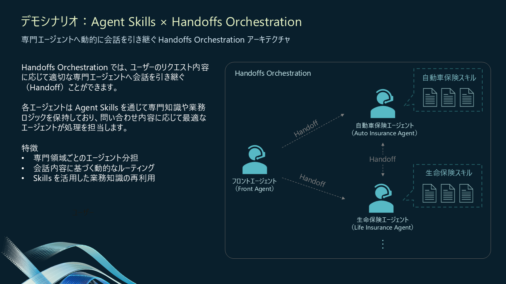

# デモシナリオを試す

MAF Studio には、すぐに試せる **Contoso 保険コンタクトセンター** シナリオが同梱されています。

フロントエージェントが顧客の用件を聞き取り、自動車保険・生命保険の専門エージェントへ Handoff するデモです。

---

## プリインストールエージェント

| エージェント | 役割 | 搭載スキル |
|---|---|---|
| **front_agent** | 初回対応・本人確認・用件特定・専門エージェントへのルーティング | `customer_lookup` |
| **auto_insurance_agent** | 自動車保険の新規契約・変更・解約 | `auto_insurance_quote`, `auto_insurance_recommendation`, `auto_insurance_contract_create`, `auto_insurance_contract_cancel`, `customer_profile_summary`, `activity_log_writer` |
| **life_insurance_agent** | 生命保険の新規契約・変更・解約 | `life_insurance_quote`, `life_insurance_recommendation`, `life_insurance_contract_create`, `life_insurance_contract_cancel`, `customer_profile_summary`, `activity_log_writer` |

各スキルの詳細（入力・出力・スクリプト仕様）は `data/skills/<スキル名>/SKILL.md` を参照してください。

---

## プリインストールハンドオフ

**保険マルチエージェント** というハンドオフ設定が同梱されています。

| 項目 | 内容 |
|---|---|
| **開始エージェント** | front_agent |
| **参加エージェント** | front_agent / auto_insurance_agent / life_insurance_agent |
| **ルーティングルール** | front_agent → auto_insurance_agent または life_insurance_agent（用件に応じて）、専門エージェント間の相互 Handoff も可能 |
| **終了キーワード** | `goodbye` |

---

## サンプル CRM データベース

デモ環境には **Contoso 保険** の CRM データが CSV 形式で同梱されています（`demo_app/data/`）。

| ファイル | テーブルイメージ | 主なカラム |
|---|---|---|
| `customers.csv` | 顧客マスタ | `customer_id`, 氏名/カナ, 性別, 生年月日, 連絡先, 住所, 職業, 年収, 担当エージェント, メモ |
| `contracts.csv` | 契約テーブル | `contract_id`, `customer_id`, `product_id`, 契約日, 保険料, 保障額, 支払方法, 被保険者, 受取人 |
| `products.csv` | 商品マスタ | `product_id`, 商品名, カテゴリ（自動車保険/生命保険）, 保険料, 対象年齢, 特徴 |
| `activities.csv` | 活動履歴テーブル | `activity_id`, `customer_id`, 活動種別, 日付, 担当者, 件名, 内容, 対応結果, 次回アクション |

> **実運用を想定した設計について**
>
> デモ環境では手軽に試せるよう CSV ファイルを直接読み書きする実装になっていますが、各スキルのスクリプトは **CRM データベースへの SQL クエリや API 呼び出しに置き換えることを想定した構造** で書かれています。本番導入時はスクリプト内のデータアクセス部分を実際の DB / API に差し替えるだけで、エージェントのロジックやスキル定義はそのまま流用できます。

---

## 試し方

**Skill Visualization** タブに切り替え、以下のフレーズを順番に入力してみてください（デモ顧客: 又吉 佑樹）：

| 発話 | 期待される動き |
|---|---|
| `こんにちは` | front_agent が応答 |
| `又吉佑樹です。` | customer_lookup スキルで本人確認 |
| `生命保険を解約したいです。` | life_insurance_agent へ Handoff |
| `そのまま解約でお願いします。` | 解約スキルを実行 |
| `ありがとうございます。次に自動車保険を加入したいです。` | auto_insurance_agent へ Handoff |
| `普通車です。新車なので、保証が手厚いプランに入りたいです。` | プラン推薦スキルを実行 |
| `新車なので、本日付けでプレミアムに加入をお願いします。クレカ支払いで。` | 契約作成スキルを実行 |

会話が進むにつれてスキルが段階的に読み込まれる様子から、Agent Skills がエージェントのコンテキストをどのように拡充しているかを把握できます。

| 表示 | 内容 |
|---|---|
| **Advertise** | エージェントのシステム指示に入力されたスキルの名前と説明の一覧 |
| **Load Skills** | 詳細を読み込んだ SKILL.md の一覧 |
| **Read resorces & Run scripts** | 追加リソースが読み込み、もしくはスクリプトの実行 |

